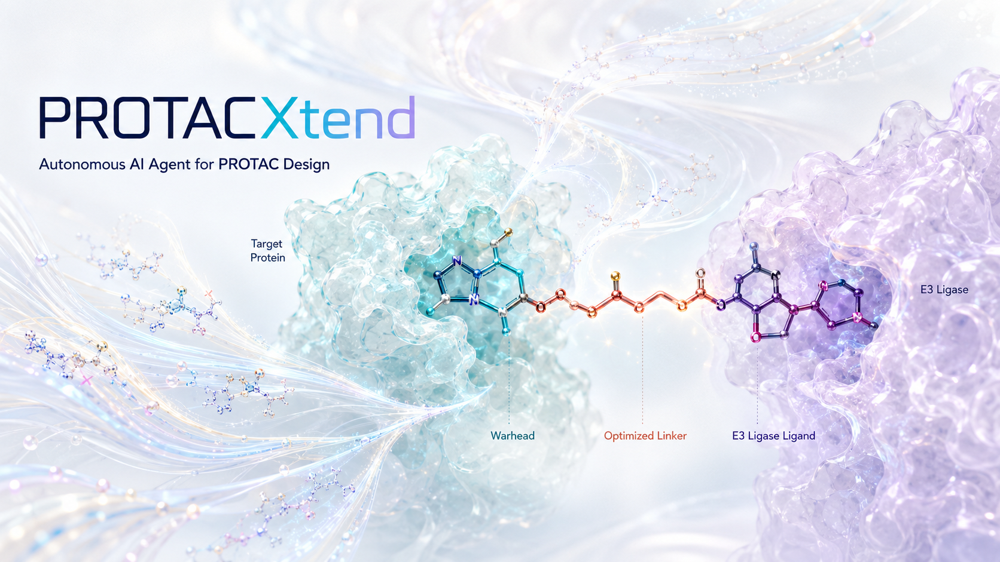

# PROTACXtend

<p align="center">
  
</p>


[](https://the-ahuja-lab.github.io/PROTACXtend/)
[](https://github.com/the-ahuja-lab/PROTACXtend/actions/workflows/ci.yml)
[](LICENSE)

PROTACXtend is a local, tool-augmented AI agent platform for component-aware PROTAC design, ternary complex feasibility modeling, and degradation prediction.

- **Live website**: [`the-ahuja-lab.github.io/PROTACXtend`](https://the-ahuja-lab.github.io/PROTACXtend/) (GitHub Pages — hero overview, capabilities, mechanisms, model panel, validation matrix, workflows, walkthrough & docs)
- **GitHub Repository**: [`the-ahuja-lab/PROTACXtend`](https://github.com/the-ahuja-lab/PROTACXtend)
- **Organization**: Ahuja Lab ([@the-ahuja-lab](https://github.com/the-ahuja-lab))
- **Lead Developer**: Saveena Solanki ([@SaveenaSolanki](https://github.com/SaveenaSolanki))
- **Web App source**: [`website/`](website/index.html) — pure static landing page, interactive simulator & documentation hub (no build step)
- **Documentation**: [`documentation/`](documentation/README.md) — installation, architecture (23-node core + 8 extensions = 31 documented nodes), workflows, API reference, and GitHub collaborator setup.

The system takes a natural-language design objective, converts it into a structured workflow state, and runs a governed agent graph — a 23-node core scientific workflow plus 8 controlled-search/feedback extensions (31 documented nodes; status source of truth: `config/scientific_status.yaml`) — to build candidate PROTAC records, score them with deterministic tools, mechanistic modules and ML models, rank candidates, and output reports, CSV and JSON data. Every executed step records its input, output, evidence source, model version and limitation.

Quick start: [documentation/GETTING_STARTED.md](documentation/GETTING_STARTED.md) · workflows: [documentation/WORKFLOWS.md](documentation/WORKFLOWS.md) · status source of truth: [`config/scientific_status.yaml`](config/scientific_status.yaml).


## Architecture

```text
User prompt / UI form / API request
        |
        v
Streamlit UI / FastAPI / CLI
        |
        v
protacxtend.backend.main
        |
        v
Agentic wrapper mode:
Perception -> Reasoning -> Goal Setting -> Decision-Making
  -> Execution -> Scientific Critic -> Learning -> Orchestration
        |
        v
LangGraph workflow if installed
or local deterministic state-machine fallback
        |
        v
DesignPlannerAgent
        |
        v
Specialist ReAct-style agents
        |
        v
Deterministic chemistry, database, prediction, ranking, memory, and report tools
        |
        v
Markdown report + candidate CSV/JSON + workflow memory
```

Main modules:

- `protacxtend/app/streamlit_app.py`: Streamlit research workspace.
- `protacxtend/backend/api_routes.py`: FastAPI routes.
- `protacxtend/backend/main.py`: CLI and workflow entry points.
- `protacxtend/agentic/`: seven-layer agentic control system for perception, reasoning, goal setting, decision-making, execution, learning/adaptation, and orchestration.
- `protacxtend/schemas/`: typed state, evidence, candidate provenance, tool result, and memory schemas.
- `protacxtend/agents/graph.py`: LangGraph workflow builder with a local fallback graph.
- `protacxtend/agents/design_planner_agent.py`: top-level planner that decides tool routing, retry policy, external evidence search, missing-input questions, stop rules, scientific invalidity rules, and deeper validation gates.
- `protacxtend/agents/*_agent.py`: specialist agents for target, binder, warhead, E3, linker, construction, prediction, ADME/Tox, novelty, ternary feasibility, ranking, reflection, report, and memory.
- `protacxtend/tools/*.py`: deterministic tools used by agents.
- `protacxtend/data/*.csv`: local curated targets, binders, E3 ligands, linkers, known PROTACs, and demo database files.
- `protacxtend/memory/`: workflow logs, chat history, and local literature/run memory.
- `protacxtend/outputs/`: generated reports and candidate tables.

## LLM And Model Status

The current default workflow does not call an external hosted LLM such as OpenAI, Anthropic, Gemini, or Groq.

Instead, agents are implemented as deterministic ReAct-style Python classes. Each agent records:

- thought
- action
- observation
- elapsed time

The top-level `DesignPlannerAgent` now creates an explicit `design_plan` before specialist agents run. The plan records which tools should be called, which steps may be retried, whether external evidence should be searched, when the workflow should stop, what input should be requested from the user, how scientifically invalid candidates should be handled, and whether deeper validation such as ADME constraints, retrosynthesis filtering, or docking/ternary triage should run.

The orchestration layer is compatible with:

- `LangGraph` for graph execution when installed.
- A local state-machine fallback when LangGraph is unavailable.
- Lightweight adapter hooks for `LangChain` tools and `Agno` supervisors.

Prediction model status:

- Degradation/DC50/Dmax currently uses `SynGlue-demo-heuristic-v0.1` when trained model files are not present.
- The model loader can discover real DC50/Dmax model files from `models/`, but no validated trained model is shipped by default.
- ADME/Tox uses RDKit descriptors plus descriptor/rule-based or heuristic fallback unless configured local/API models are available.
- Ternary feasibility is a geometry/docking-ready scaffold. Vina/GNINA can be detected, but real docking is not run unless those backends are installed and selected.

So the honest answer is: the project is LLM-ready and agentic, but the current checked-in workflow uses deterministic agents and heuristic/local model backends by default.

## Seven Agentic Capabilities

PROTACXtend now includes an additive seven-layer agentic wrapper around the deterministic chemistry workflow:

| Capability | Implementation | Purpose |
| --- | --- | --- |
| Perception | `protacxtend/agentic/perception.py` | Collects the user request, parsed entities, local datasets, available models, RDKit/docking/LangGraph status, similar memory records, missing inputs, and risk flags. |
| Reasoning | `protacxtend/agentic/reasoning.py` | Interprets the request using explicit PROTAC rules: target suitability, binder availability, E3 assumptions, exit-vector risk, linker strategy, ADME/Tox risk, ternary need, and heuristic-vs-model evidence. |
| Goal Setting | `protacxtend/agentic/goal_setting.py` | Converts the request into a typed `DesignGoal` with objectives, constraints, validation depth, fallback policy, stop criteria, and success criteria. |
| Decision-Making | `protacxtend/agentic/decision_making.py` | Chooses the next action and fallback based on missing inputs, tool availability, scientific risk, and previous failures. |
| Execution | `protacxtend/agentic/execution.py` | Calls deterministic tools through a registry, catches exceptions, records runtime, and returns typed `ToolResult` objects. |
| Learning and Adaptation | `protacxtend/agentic/learning.py` | Stores structured JSONL memory records for successful strategies, failures, warnings, model versions, and reusable lessons. |
| Orchestration | `protacxtend/agentic/orchestration.py` | Coordinates all layers and then delegates scientific generation/scoring to the existing deterministic workflow. |

The scientific rule is strict: let the LLM or agent layer plan, critique, route, recover, and explain. Let RDKit, docking tools, curated databases, configured trained models, or clearly marked heuristic fallback modules produce scientific evidence. This keeps reports robust, honest, and publishable.

The agentic output includes:

- structured perception state
- explicit design goal
- decision trace
- `ToolResult` records
- scientific critic warnings
- candidate provenance
- memory updates
- markdown report
- candidate CSV/JSON paths

## Agent Flow

The workflow in `protacxtend/agents/graph.py` runs in this order:

```text
1.  SupervisorAgent
    Parse the user request into a structured PROTAC objective.

2.  DesignPlannerAgent
    Decide tool routing, retries, external evidence search, stopping rules, missing-input questions, invalidity checks, and deeper validation depth.

3.  SafetyGuardrailAgent
    Add scientific and safety guardrails.

4.  TargetResolverAgent
    Resolve target metadata from local curated data and optional external wrappers.

5.  TargetBinderRetrievalAgent
    Retrieve known binders or local/demo warhead seeds.

6.  WarheadSelectionAgent
    Select warheads using potency, derivatization, and source-confidence heuristics.

7.  E3LigandSelectionAgent
    Select E3 ligands, usually CRBN/VHL demo ligands unless the user specifies one.

8.  ExitVectorDetectionAgent
    Detect attachment points from dummy atoms, curated maps, and heuristics.

9.  LinkerGenerationAgent
    Generate curated and rule-based linker panels.

10. MolecularConstructionAgent
    Assemble PROTAC candidates from warhead + linker + E3 ligand combinations.

11. CandidateValidationAgent
    Validate or flag candidates using RDKit when available.

12. DegradationPredictionAgent
    Estimate DC50/Dmax/degradation confidence using the configured model backend or heuristic fallback.

13. ADMETAgent
    Score permeability, solubility, hERG, AMES, DILI, CYP, P-gp, and related risks.

14. NoveltySimilarityAgent
    Compare candidates with the local known-PROTAC set.

15. ApplicabilityDomainAgent
    Mark whether predictions are inside the current demo/model domain.

16. RankingTournamentAgent
    Produce an initial weighted ranking.

17. ProximityDiversityAgent
    Track diversity/proximity information for top candidates.

18. ReflectionReviewAgent
    Review candidate weaknesses and warning flags.

19. EvolutionRefinementAgent
    Propose refined candidates when possible.

20. TernaryFeasibilityAgent
    Optionally assess ternary feasibility or docking readiness.

21. FinalRankingTournamentAgent
    Re-rank candidates after review/evolution/ternary checks.

22. ReportAgent
    Generate markdown report content and candidate tables.

23. MemoryUpdateAgent
    Persist a reproducible workflow summary locally.
```

## Full Request-To-Output Flow

```text
Natural-language request
  -> perception state
  -> reasoning state
  -> explicit design goal
  -> next-action decision
  -> execution through deterministic tool registry
  -> scientific critic and validation
  -> learning/memory update
  -> agentic report and artifacts
```

The agentic wrapper then invokes the existing deterministic design path:

```text
Natural-language request
  -> parsed objective
  -> design plan
  -> safety precheck
  -> target resolution
  -> binder retrieval
  -> warhead selection
  -> E3 ligand selection
  -> exit-vector detection
  -> linker generation
  -> PROTAC construction
  -> RDKit validation / fallback validation
  -> DC50/Dmax heuristic or configured model prediction
  -> ADME/Tox scoring
  -> novelty scoring
  -> applicability-domain check
  -> initial ranking
  -> diversity/reflection/evolution review
  -> optional ternary feasibility
  -> final ranking
  -> markdown report
  -> CSV and JSON exports
  -> local workflow memory
```

Outputs are written to:

- `protacxtend/outputs/reports/*.md`
- `protacxtend/outputs/candidates/*.csv`
- `protacxtend/outputs/candidates/*.json`
- `protacxtend/memory/workflow_logs/*.json`
- `protacxtend/memory/agentic_design_memory.jsonl`

## Runtime

Runtime depends on candidate count, RDKit availability, network/API calls, and whether real docking or trained models are enabled.

Observed local smoke run on this repository:

```bash
/usr/bin/time -p python3 -m protacxtend.backend.main --mode design \
  "Design CRBN-based PROTACs for BRD4. Generate 20 candidates using PEG and alkyl linkers with low hERG risk." \
  --stem readme_runtime_check
```

Result:

```text
real 11.53 seconds
binders retrieved: 2721
warheads selected: 8
E3 ligands selected: 3
linkers generated: 7
construction attempts: 20
valid candidates: 20
final candidates: 20
top score: 0.686
```

Typical local expectations:

| Mode | Expected time |
| --- | --- |
| 10-20 candidates, local data, RDKit descriptors | about 5-20 seconds |
| 50 candidates, local data, RDKit descriptors | about 10-60 seconds |
| Online target/binder lookups enabled | seconds to minutes, network dependent |
| Real retrosynthesis | minutes or longer |
| Real ternary docking/modeling | minutes to hours |
| Full validated model stack with external APIs | backend dependent |

The smoke run also showed network failures for UniProt/RCSB because network access was unavailable, so the workflow retained local curated fallback data.

## Installation

```bash
python3 -m venv .venv
source .venv/bin/activate
pip install -r requirements.txt
```

Core dependencies:

- Python
- RDKit
- Pydantic
- LangGraph
- LangChain
- Agno
- FastAPI
- Uvicorn
- Streamlit
- Pandas
- NumPy

## Run The CLI

```bash
python3 -m protacxtend.backend.main --mode design \
  "Design CRBN-based PROTACs for BRD4. Generate 20 candidates using PEG and alkyl linkers with low hERG risk." \
  --stem brd4_crbn_demo
```

Run the agentic architecture:

```bash
python3 -m protacxtend.backend.main --mode agentic-design \
  "Design CRBN-based PROTACs for BRD4. Generate 20 CRBN candidates using PEG and alkyl linkers with low hERG risk." \
  --stem brd4_agentic
```

## Run The Streamlit App

```bash
streamlit run protacxtend/app/streamlit_app.py
```

## Run The API

```bash
uvicorn protacxtend.backend.api_routes:app --reload
```

Example request:

```bash
curl -X POST http://127.0.0.1:8000/design \
  -H "Content-Type: application/json" \
  -d '{"request":"Design CRBN-based PROTACs for BRD4. Generate 20 candidates."}'
```

Agentic request:

```bash
curl -X POST http://127.0.0.1:8000/agentic-design \
  -H "Content-Type: application/json" \
  -d '{"request":"Design CRBN-based PROTACs for BRD4. Generate 20 candidates.","config":{"validation_depth":"medium","allow_heuristic_fallback":true}}'
```

## Data And Tooling

Local curated files:

- `curated_targets.csv`
- `curated_warheads.csv`
- `curated_e3_ligands.csv`
- `curated_linkers.csv`
- `curated_exit_vector_map.csv`
- `known_protac_smiles.csv`
- `protacdb_local.csv`
- `protacpedia_local.csv`
- `drugbank_local.csv`

Tool categories:

- target and biology lookup
- binder/warhead retrieval
- E3 ligand selection
- exit-vector detection
- linker generation
- molecular construction
- RDKit validation and descriptors
- degradation/DC50/Dmax scoring
- ADME/Tox scoring
- novelty checking
- ternary feasibility and docking readiness
- ranking and reporting
- local workflow memory

### Retrosynthesis toolkit engines (working integrations)

Three retrosynthesis engines are integrated as real toolkits behind the
`run_retrosynthesis` stage (module: `protacxtend/tools/retrosynthesis_engines.py`).
Every engine reports availability honestly and never fabricates routes; a single
result carries per-engine provenance (`RetrosynthesisResult.engine_outcomes`).

| Engine | License | Backend | Status probe | Local / web |
|---|---|---|---|---|
| **ASKCOS** (MIT) | MIT | `AskcosClient` REST (one-step `retro/controller`, Retro* `tree-search`, `buyables`) | `GET {base}/openapi.json` | public `askcos.mit.edu` or local Docker via `ASKCOS_API_URL` |
| **AiZynthFinder** (AstraZeneca) | MIT | `aizynthfinder` MCTS + neural policy | package import + `data/retrosynthesis/models/aizynth` assets (`scripts/bootstrap_assets.sh --aizynth`) | local Python |
| **RDKit + OpenNMT** (Molecular Transformer) | RDKit BSD-3 / OpenNMT MIT | RDKit preprocess -> `onmt` translate -> RDKit validate | `onmt` import + `data/retrosynthesis/models/openmt/retro_model.pt` (or `OPENMT_MODEL`) | local Python pipeline |

Quick checks / runs:

```bash
python - <<'PY'
from protacxtend.tools.retrosynthesis_engines import render_engine_status_report
print(render_engine_status_report(skip_network=True))   # honest availability
PY

python scripts/retrosynthesis_toolkits_smoke.py --engines askcos \
    --smiles "CC(=O)Oc1ccccc1C(=O)O"                       # live one-step evidence
python scripts/retrosynthesis_toolkits_smoke.py --engines askcos --tree-search   # Retro* tree
python scripts/retrosynthesis_toolkits_smoke.py --engines aizynth,openmt --offline
```

Evidence is written under `outputs/retrosynthesis_toolkits/evidence.json`.

### Scientific deep-research framework (LangGraph)

Low-cost, production-ready evidence retrieval + synthesis with a single
`deep_research(query)` API — `protacxtend/research/` (docs:
`documentation/DEEP_RESEARCH.md`). Pipeline: Europe PMC/PubMed first →
OpenAlex citation graph → Crossref DOI validation → self-hosted SearXNG →
Crawl4AI/clean full-text extraction → DOI/PMID/URL/title dedup → local
cross-encoder/embedding reranking (lexical fallback) → claim-level citation
verification (no fabrication) → cheap/local LLM synthesis (strong LLM reserved
for hard plans). Insufficient evidence triggers automatic query reformulation
within a bounded LangGraph loop; every run writes a reproducible trace.

```bash
python scripts/deep_research_cli.py "PROTAC BRD4 degradation cancer" --no-llm
```

## Scientific Limitations

- Current DC50/Dmax values are heuristic demo outputs unless real model files are loaded.
- Current ADME/Tox output is descriptor/rule-based or heuristic unless a configured model/API backend is used.
- Local curated/demo data are not a replacement for validated medicinal chemistry databases.
- Docking, retrosynthesis, patent novelty, and production-grade online database integrations are scaffolded but not guaranteed to run by default.
- PROTAC activity depends on ternary geometry, cell context, expression, permeability, degradation machinery, and experimental conditions not fully captured here.
- Human medicinal chemistry, structural biology, DMPK/tox, and experimental review are required before synthesis or wet-lab testing.

## Tests

Run the focused workflow test:

```bash
python3 -m unittest protacxtend.tests.test_workflow
```

Run the main test suite:

```bash
python3 -m pytest tests protacxtend/tests
```
